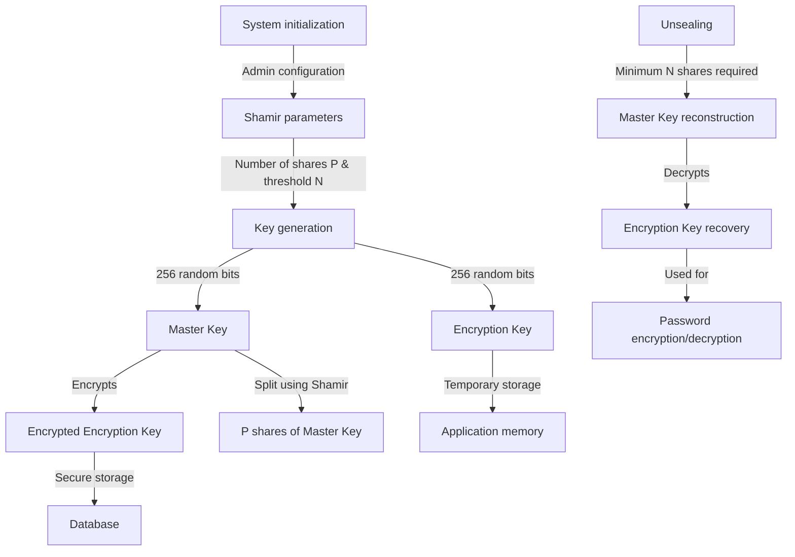
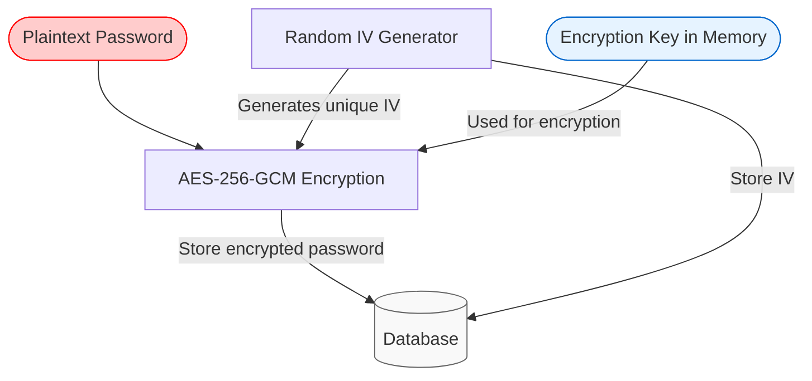
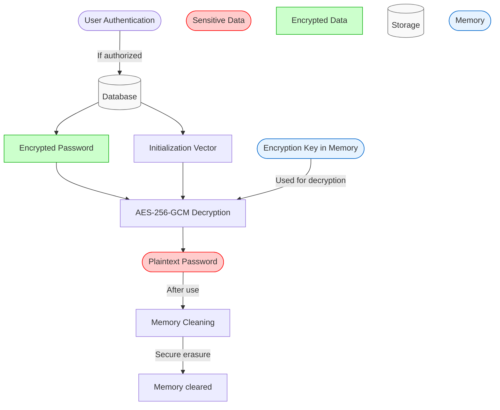

# Cryptographic Architecture

## Process of creation of the encryption key

During initialization, the administrator configures two essential parameters:

- The total number of shares (P) for the Master Key
- The reconstruction threshold (N), which defines the minimum number of shares needed to reconstruct the Master Key
- The system then generates two 256-bit cryptographic keys:

Master Key: Primary key which:

- Is used to encrypt the Encryption Key before storing it in the database
- Is immediately divided into P distinct shares using Shamir's algorithm
- Is never kept whole in the system after its creation

Encryption Key: Operational key which:

- Is temporarily stored in memory for encryption/decryption operations
- Is also stored in the database, but only in a form encrypted by the Master Key
- Enables the encryption and decryption of passwords and sensitive data

Shamir's algorithm ensures that at least N shares out of P are necessary to reconstruct the Master Key.
This approach provides enhanced security: even if some shares are compromised,
the Master Key remains protected as long as fewer than N shares are exposed.

When the application restarts, an unsealing process requires providing at least N shares to temporarily reconstruct the Master Key,
decrypt the Encryption Key, and place it in memory for use.

All encryption and decryption operations use the AES-256-GCM algorithm,
providing both confidentiality and data authenticity.

## Process of encryption and decryption of a password

In this process, we assume that the database is unsealed (Encryption key is stored in memory).

When a user creates a password,
the system generates a random Initialization Vector (IV) and
uses it to encrypt the password with the Encryption Key using AES-256-GCM.
The IV is stored in the database alongside the encrypted password.

When a user wants to retrieve a password, the system:

1. Authenticates the user's access permissions
2. Fetches the encrypted password and IV from the database
3. Decrypts the password using the Encryption Key stored in memory
4. Presents the plaintext password to the user
5. Securely clears the plaintext password from memory after use

The IV is essential for ensuring that the same password encrypted multiple times will yield different ciphertexts, preventing pattern analysis and enhancing security.

### Encryption Process

### Decryption Process

