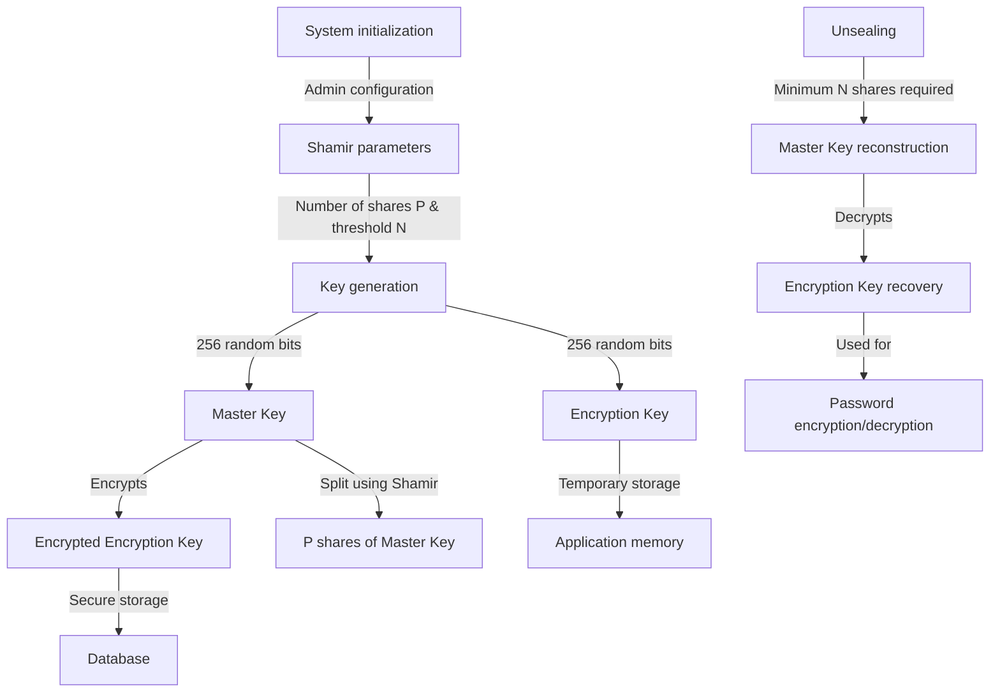
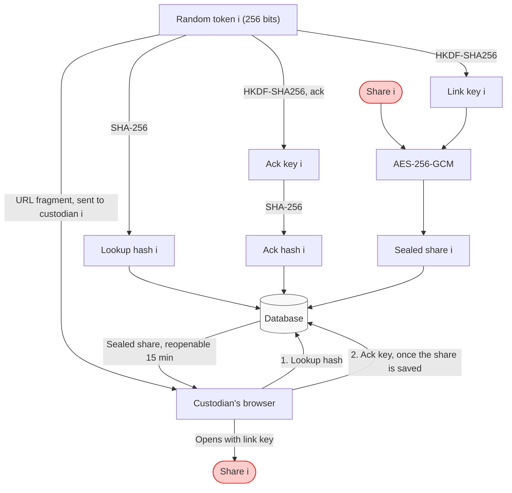
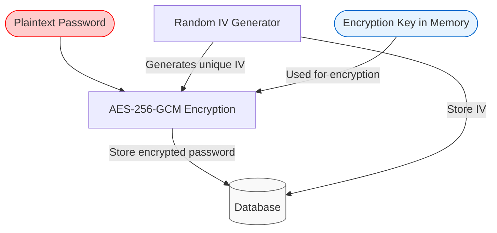

# Cryptographic Architecture

## Process of creation of the encryption key

During initialization, the administrator configures two essential parameters:

- The total number of shares (P) for the Master Key
- The reconstruction threshold (N), which defines the minimum number of shares needed to reconstruct the Master Key
- The system then generates two 256-bit cryptographic keys:

Master Key: Primary key which:

- Is used to encrypt the Encryption Key before storing it in the database
- Is immediately divided into P distinct shares using Shamir's algorithm
- Is never kept whole in the system after its creation

Encryption Key: Operational key which:

- Is temporarily stored in memory for encryption/decryption operations
- Is also stored in the database, but only in a form encrypted by the Master Key
- Enables the encryption and decryption of passwords and sensitive data

Shamir's algorithm ensures that at least N shares out of P are necessary to reconstruct the Master Key.
This approach provides enhanced security: even if some shares are compromised,
the Master Key remains protected as long as fewer than N shares are exposed.

When the application restarts, an unsealing process requires providing at least N shares to temporarily reconstruct the Master Key,
decrypt the Encryption Key, and place it in memory for use.

All encryption and decryption operations use the AES-256-GCM algorithm,
providing both confidentiality and data authenticity.

```mermaid
flowchart TD
    A[System initialization] -->|Admin configuration| B[Shamir parameters]
    B -->|Number of shares P & threshold N| C[Key generation]
    C -->|256 random bits| D[Master Key]
    C -->|256 random bits| E[Encryption Key]
    D -->|Encrypts| F[Encrypted Encryption Key]
    D -->|Split using Shamir| G[P shares of Master Key]
    F -->|Secure storage| H[Database]
    E -->|Temporary storage| I[Application memory]
    J[Unsealing] -->|Minimum N shares required| K[Master Key reconstruction]
    K -->|Decrypts| L[Encryption Key recovery]
    L -->|Used for| M[Password encryption/decryption]
```

## Distribution of the shares to their custodians

The shares are never stored in a form the server can read. Each share is handed out through its own
link, valid for 48 hours, which its custodian closes once the share is saved:

1. For each share, the server draws a 256-bit random token.
2. It derives three independent values from that token:
   - a **lookup hash**, `SHA-256(token)`, which addresses the link;
   - a **link key**, `HKDF-SHA256(token, info = "le-coffre/vault-share-link/v1")`, which seals the share;
   - an **ack key**, `HKDF-SHA256(token, info = "le-coffre/vault-share-link/ack/v1")`, which closes the link.
3. It seals the share with AES-256-GCM under the link key, with the setup id and the share index as
   associated data (`le-coffre/vault-share-link/v1|setup_id=<id>|share_index=<index>`), and stores the
   sealed share next to the lookup hash and `SHA-256(ack key)`. It returns only the tokens and keeps no
   copy of them, nor of the keys.
4. The administrator sends each link (`<origin>/vault-share#<token>`) to a different custodian. The token
   sits in the URL fragment, which browsers never send to a server.
5. The custodian's browser computes the lookup hash, fetches the sealed share with its setup id and share
   index, and opens it locally with the link key, rebuilding the associated data from those two values: a
   share relabelled by the server or on the way fails to open. The server keeps the link: the share is
   only safe once the custodian has saved it, which the server cannot see. The first opening starts a
   **15-minute reopen window**, cut short by the link's own expiry if that comes first, so a response
   lost on the network, a closed tab or a share that failed to open does not cost the share.
6. Once the share is saved, the custodian confirms it on the page. Their browser sends the ack key, the
   server checks it against the stored hash and deletes the link. This is only accepted within the reopen
   window: past it, the link closed on its own, and the audit trail does not show it closed by its
   custodian.

Each opening and the closing are recorded in the vault audit events in the same transaction as the change
to the link, and each opening after the first is marked as a reopening. A link is refused once closed,
past its reopen window or expired, and a background job deletes it within the hour. A link left
unconfirmed thus closes on its own when its window ends.

No account is needed to open a link, so this works before the first account exists. The links are also
independent of the vault state: nothing in them is encrypted with the Encryption Key, so custodians can
retrieve their share while the vault is locked, which is when the shares are needed.

The database alone cannot rebuild the Master Key: it holds lookup hashes, hashes of ack keys and sealed
shares, and none of them reveals a link key. Nor can it close a link: that takes the ack key, which only
the token yields. The setup does not wait for the custodians, and no listing of the links is exposed;
openings and closings are only recorded in the vault audit events, by share index. A share whose link
expires unopened is lost.

```mermaid
flowchart TD
    classDef sensitive fill:#ffcccc,stroke:#ff0000
    classDef storage fill:#f9f9f9,stroke:#666

    S(["Share i"]):::sensitive
    T["Random token i (256 bits)"]
    T -->|SHA-256| LH["Lookup hash i"]
    T -->|HKDF-SHA256| K["Link key i"]
    T -->|HKDF-SHA256, ack| AK["Ack key i"]
    AK -->|SHA-256| AH["Ack hash i"]
    S --> E["AES-256-GCM"]
    K --> E
    E --> SS["Sealed share i"]
    LH --> D[(Database)]:::storage
    AH --> D
    SS --> D
    T -->|"URL fragment, sent to custodian i"| C["Custodian's browser"]
    C -->|"1. Lookup hash"| D
    D -->|"Sealed share, reopenable 15 min"| C
    C -->|"Opens with link key"| S2(["Share i"]):::sensitive
    C -->|"2. Ack key, once the share is saved"| D
```

### What the links protect against, and what they do not

The setup screen shows the links, not the shares, but this does not take the administrator out of the
trust chain. They receive every token, and a token is all it takes to open a link: an administrator who
opens the links before sending them holds every share, just as when the setup displayed the shares. The
same goes for anyone who reads a link on its way to its custodian (mailbox, chat history).

What the links add is detection. A share taken by someone else cannot be passed on unnoticed, and every
opening is recorded in the vault audit events (`VaultEvent` table and server logs, by share index and
time, reopenings marked; no screen of the application shows them):

- if they opened it and closed it, or more than 15 minutes ago, the custodian finds the link unusable;
- if they opened it less than 15 minutes ago, the custodian still gets the share, but the page says the
  link had already been opened, and when.

The reopen window has a cost: someone holding the link who opens it **after** the custodian, before the
custodian confirms, gets the share without the custodian being told. Only the audit events show it, as a
second opening. Confirming as soon as the share is saved closes that gap; the window is kept short for
the same reason.

This detection only works if:

- each custodian opens their link within the 48 hours, and reports a link they never received;
- a custodian who finds their link unusable, or already opened, without having opened it themselves,
  reports it to someone other than whoever sent it, since the sender had the link too;
- someone checks the audit events when such a report comes in.

The retrieval page cannot tell a custodian why a link fails: an unknown, an expired, a closed link and
one past its reopen window all get the same answer. The page therefore tells the custodian that if they
have not opened the link themselves and it is less than 48 hours old, someone else may have, and asks
them to report it.

A database reader cannot open or close a link, but knowing a lookup hash, they can still open the reopen
window, after which the link closes on its own: the custodian then finds it unusable and reports it, as
above.

## Process of encryption and decryption of a password

In this process, we assume that the database is unsealed (Encryption key is stored in memory).

When a user creates a password,
the system generates a random Initialization Vector (IV) and
uses it to encrypt the password with the Encryption Key using AES-256-GCM.
The IV is stored in the database alongside the encrypted password.

When a user wants to retrieve a password, the system:

1. Authenticates the user's access permissions
2. Fetches the encrypted password and IV from the database
3. Decrypts the password using the Encryption Key stored in memory
4. Presents the plaintext password to the user
5. Securely clears the plaintext password from memory after use

The IV is essential for ensuring that the same password encrypted multiple times will yield different ciphertexts, preventing pattern analysis and enhancing security.

### Encryption Process

```mermaid
flowchart TD
    %% Styles
    classDef sensitive fill:#ffcccc,stroke:#ff0000
    classDef storage fill:#f9f9f9,stroke:#666
    classDef memory fill:#e6f3ff,stroke:#0066cc

    A(["Plaintext Password"]):::sensitive
    B["Random IV Generator"]
    C["AES-256-GCM Encryption"]
    D[(Database)]:::storage
    E(["Encryption Key in Memory"]):::memory

    A --> C
    B --> |"Generates unique IV"| C
    E --> |"Used for encryption"| C
    C --> |"Store encrypted password"| D
    B --> |"Store IV"| D
```

### Decryption Process

```mermaid
flowchart TD
    %% Styles
    classDef sensitive fill:#ffcccc,stroke:#ff0000
    classDef encrypted fill:#ccffcc,stroke:#00aa00
    classDef storage fill:#f9f9f9,stroke:#666
    classDef memory fill:#e6f3ff,stroke:#0066cc

    F(["User Authentication"])
    G[(Database)]:::storage
    H["Encrypted Password"]:::encrypted
    I["Initialization Vector"]
    J(["Encryption Key in Memory"]):::memory
    K["AES-256-GCM Decryption"]
    L(["Plaintext Password"]):::sensitive
    M["Memory Cleaning"]

    F --> |"If authorized"| G
    G --> H & I
    H --> K
    I --> K
    J --> |"Used for decryption"| K
    K --> L

    %% Legend
    O(["Sensitive Data"]):::sensitive
    P["Encrypted Data"]:::encrypted
    Q[(Storage)]:::storage
    R(["Memory"]):::memory
```
