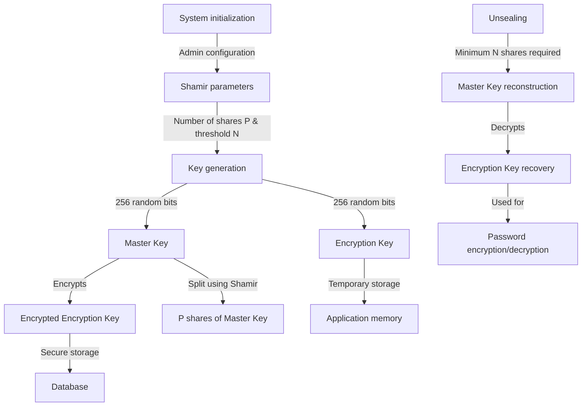
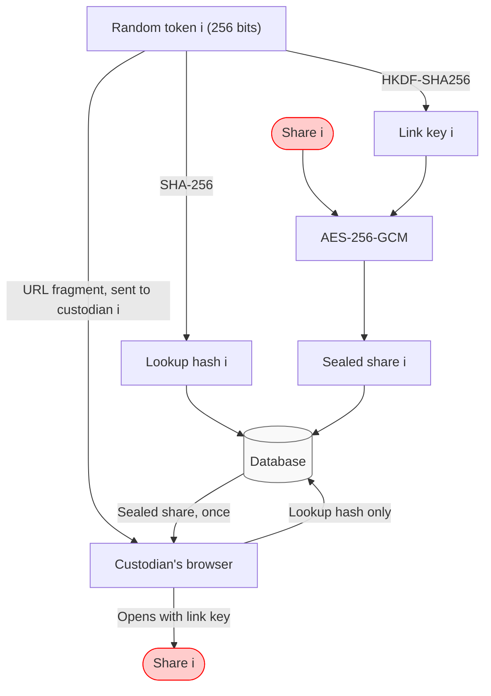
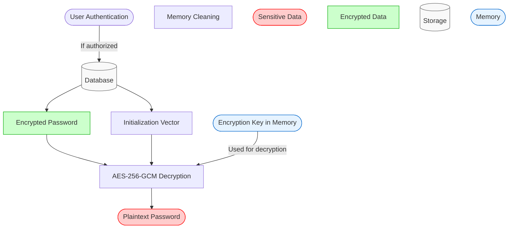

# Cryptographic Architecture

## Process of creation of the encryption key

During initialization, the administrator configures two essential parameters:

- The total number of shares (P) for the Master Key
- The reconstruction threshold (N), which defines the minimum number of shares needed to reconstruct the Master Key
- The system then generates two 256-bit cryptographic keys:

Master Key: Primary key which:

- Is used to encrypt the Encryption Key before storing it in the database
- Is immediately divided into P distinct shares using Shamir's algorithm
- Is never kept whole in the system after its creation

Encryption Key: Operational key which:

- Is temporarily stored in memory for encryption/decryption operations
- Is also stored in the database, but only in a form encrypted by the Master Key
- Enables the encryption and decryption of passwords and sensitive data

Shamir's algorithm ensures that at least N shares out of P are necessary to reconstruct the Master Key.
This approach provides enhanced security: even if some shares are compromised,
the Master Key remains protected as long as fewer than N shares are exposed.

When the application restarts, an unsealing process requires providing at least N shares to temporarily reconstruct the Master Key,
decrypt the Encryption Key, and place it in memory for use.

All encryption and decryption operations use the AES-256-GCM algorithm,
providing both confidentiality and data authenticity.

```mermaid
flowchart TD
    A[System initialization] -->|Admin configuration| B[Shamir parameters]
    B -->|Number of shares P & threshold N| C[Key generation]
    C -->|256 random bits| D[Master Key]
    C -->|256 random bits| E[Encryption Key]
    D -->|Encrypts| F[Encrypted Encryption Key]
    D -->|Split using Shamir| G[P shares of Master Key]
    F -->|Secure storage| H[Database]
    E -->|Temporary storage| I[Application memory]
    J[Unsealing] -->|Minimum N shares required| K[Master Key reconstruction]
    K -->|Decrypts| L[Encryption Key recovery]
    L -->|Used for| M[Password encryption/decryption]
```

## Distribution of the shares to their custodians

The shares are never displayed to the administrator who runs the setup, and never stored in a form
the server can read. Each share is handed out through its own single-use link, valid for 48 hours:

1. For each share, the server draws a 256-bit random token.
2. It derives two independent values from that token:
   - a **lookup hash**, `SHA-256(token)`, which is the only thing stored to address the link;
   - a **link key**, `HKDF-SHA256(token, info = "le-coffre/vault-share-link/v1")`.
3. It seals the share with AES-256-GCM under the link key, stores the sealed share next to the lookup hash,
   and returns only the tokens. The server keeps no copy of them.
4. The administrator sends each link (`<origin>/vault-share#<token>`) to a different custodian. The token
   sits in the URL fragment, which browsers never send to a server.
5. The custodian's browser computes the lookup hash, fetches the sealed share once, and opens it locally
   with the link key. The server deletes the link in the same conditional write that hands it out;
   expired links are deleted too.

No account is needed to open a link, so this works before the first account exists. The links are also
independent of the vault state: nothing in them is encrypted with the Encryption Key, so custodians can
retrieve their share while the vault is locked, which is when the shares are needed.

The database alone cannot rebuild the Master Key: it holds lookup hashes and sealed shares, and neither
reveals a link key. The setup does not wait for the custodians, and no listing of the links is exposed;
each retrieval is only recorded in the vault audit events, by share index. A share whose link expires
unopened is lost.

```mermaid
flowchart TD
    classDef sensitive fill:#ffcccc,stroke:#ff0000
    classDef storage fill:#f9f9f9,stroke:#666

    S(["Share i"]):::sensitive
    T["Random token i (256 bits)"]
    T -->|SHA-256| LH["Lookup hash i"]
    T -->|HKDF-SHA256| K["Link key i"]
    S --> E["AES-256-GCM"]
    K --> E
    E --> SS["Sealed share i"]
    LH --> D[(Database)]:::storage
    SS --> D
    T -->|"URL fragment, sent to custodian i"| C["Custodian's browser"]
    C -->|"Lookup hash only"| D
    D -->|"Sealed share, once"| C
    C -->|"Opens with link key"| S2(["Share i"]):::sensitive
```

## Process of encryption and decryption of a password

In this process, we assume that the database is unsealed (Encryption key is stored in memory).

When a user creates a password,
the system generates a random Initialization Vector (IV) and
uses it to encrypt the password with the Encryption Key using AES-256-GCM.
The IV is stored in the database alongside the encrypted password.

When a user wants to retrieve a password, the system:

1. Authenticates the user's access permissions
2. Fetches the encrypted password and IV from the database
3. Decrypts the password using the Encryption Key stored in memory
4. Presents the plaintext password to the user
5. Securely clears the plaintext password from memory after use

The IV is essential for ensuring that the same password encrypted multiple times will yield different ciphertexts, preventing pattern analysis and enhancing security.

### Encryption Process

```mermaid
flowchart TD
    %% Styles
    classDef sensitive fill:#ffcccc,stroke:#ff0000
    classDef storage fill:#f9f9f9,stroke:#666
    classDef memory fill:#e6f3ff,stroke:#0066cc

    A(["Plaintext Password"]):::sensitive
    B["Random IV Generator"]
    C["AES-256-GCM Encryption"]
    D[(Database)]:::storage
    E(["Encryption Key in Memory"]):::memory

    A --> C
    B --> |"Generates unique IV"| C
    E --> |"Used for encryption"| C
    C --> |"Store encrypted password"| D
    B --> |"Store IV"| D
```

### Decryption Process

```mermaid
flowchart TD
    %% Styles
    classDef sensitive fill:#ffcccc,stroke:#ff0000
    classDef encrypted fill:#ccffcc,stroke:#00aa00
    classDef storage fill:#f9f9f9,stroke:#666
    classDef memory fill:#e6f3ff,stroke:#0066cc

    F(["User Authentication"])
    G[(Database)]:::storage
    H["Encrypted Password"]:::encrypted
    I["Initialization Vector"]
    J(["Encryption Key in Memory"]):::memory
    K["AES-256-GCM Decryption"]
    L(["Plaintext Password"]):::sensitive
    M["Memory Cleaning"]

    F --> |"If authorized"| G
    G --> H & I
    H --> K
    I --> K
    J --> |"Used for decryption"| K
    K --> L

    %% Legend
    O(["Sensitive Data"]):::sensitive
    P["Encrypted Data"]:::encrypted
    Q[(Storage)]:::storage
    R(["Memory"]):::memory
```
