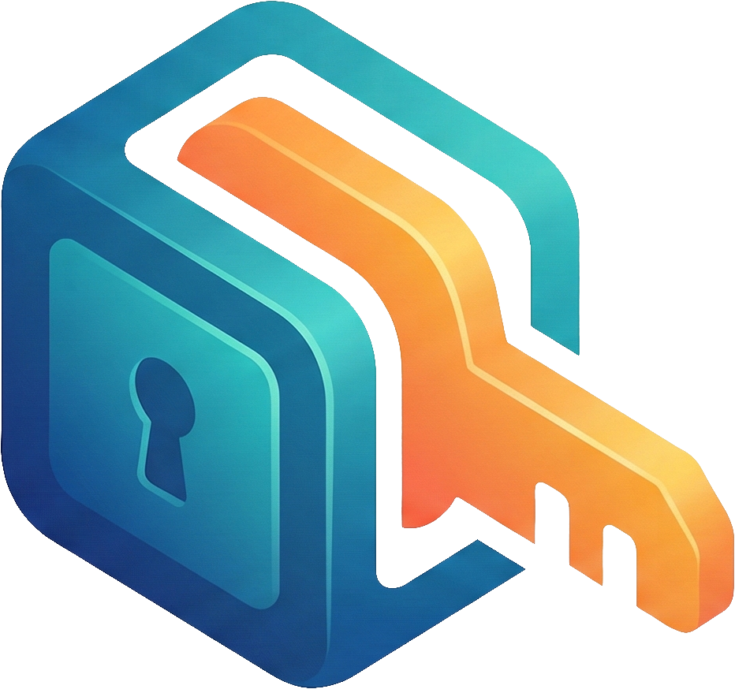

# Le Coffre



Le Coffre is an open-source password manager that allows you to securely store and manage passwords in a collaboration-friendly environment.

## Table of Contents

- [License](#license)
- [Contributing](#contributing)
- [Security implementation](#security-implementation)
- [Init](#init)
- [TODO](#todo)
- [Library used](#library-used)
- [Production deployment](#production-deployment)
- [Security considerations](#security-considerations)
- [Database Migrations](#database-migrations)
- [Development Server](#development-server)
- [Production](#production)
- [Security](#security)

## License

This project is licensed under the MIT License. You are free to use, modify, and distribute this project under the terms of the license.

## Contributing

We welcome contributions from the community! To contribute:

1. Fork the repository.
2. Create a new branch for your feature or bug fix.
3. Commit your changes with clear and descriptive messages.
4. Open a pull request and describe your changes.

Please read our CONTRIBUTING.md for detailed guidelines.

## Security implementation

Le Coffre uses the following security measures to ensure the safety of your passwords:

1. At initialization, a random 256-byte key is generated, Shamir is then used to split the key into P shares, N of which are needed to reconstruct the key (P, N are configurable).
2. This master key serve to encrypt the encryption key.
3. Each password is uniquely salted with a random 256-byte key generated at the time of password creation and encrypted using the encryption key.

## Init

1. Shamir process starts.
2. User is invited to create an admin account (mail, password, name).
3. Once completed, user is redirected to the admin panel where the user can setup providers, manage users,
   password entries...

## Library used

**Frontend**

- Vue 3 + Vite
- PrimeVue 4 (UI components)
- Tailwind CSS
- Pinia (state management)
- Vue Router
- Zod (schema validation)

**Backend**

- FastAPI
- SQLModel + Alembic (ORM & migrations)
- PyCryptodome (AES encryption, Shamir's Secret Sharing)
- Authlib (SSO / OAuth2 OIDC)
- passlib + bcrypt (password hashing)
- PyJWT (authentication tokens)
- Tenacity (retry logic)

## Production deployment

1. Behind a reverse proxy (nginx, caddy, etc.) with SSL termination.
2. Use the hardened Docker image provided.

## Security considerations

Before considering deploying Le Coffre in a production environment, please consider the following security measures:

1. The application is designed to be run in a secure environment, such as a private server or a trusted cloud provider. Any memory access is beyond threat model.
   See: <https://github.com/hashicorp/vault/issues/1446> for comparable issue.
2. Limit access to the application to trusted users only. Use strong passwords and two-factor authentication (2FA) where possible.
3. Regularly update the application and its dependencies to ensure that any security vulnerabilities are patched.
4. Monitor the application for any suspicious activity, such as unauthorized access attempts or unusual behavior.
5. Regularly back up the database and other important data to prevent data loss in case of a security breach or other disaster.
6. Consider using a web application firewall (WAF) to protect the application from common web-based attacks, such as SQL injection and cross-site scripting (XSS).
7. Limit the number of users who have administrative access to the application, and regularly review user permissions to ensure that only authorized users have access to sensitive data.
8. Limit access to the application to trusted IP addresses / networks, and use a VPN or other secure connection method to access the application remotely.

## Development Server

### Using Devcontainer (Recommended)

Open with VSCode and reopen in the devcontainer when prompted. The unified devcontainer includes both frontend and backend development environments with nginx as a reverse proxy.

**Quick Start:**

1. Open project in VS Code
2. Click "Reopen in Container" when prompted (VS Code will automatically detect your user's UID/GID and configure the container accordingly)
3. Use VS Code tasks to start services:
   - Press `Ctrl+Shift+P` → "Run Task" → "Start All Services"

See [.devcontainer/README.md](.devcontainer/README.md) for detailed instructions.

**Access Points:**

- **Main App:** <http://127.0.0.1:8123> (via nginx - use this for development)
- Frontend (direct): <http://127.0.0.1:5173>
- Backend API (direct): <http://127.0.0.1:8000>
- API Docs: <http://127.0.0.1:8000/docs>
- OpenAPI Spec: <http://127.0.0.1:8000/openapi.json>

> **Why nginx?** The frontend makes API calls to `/api/*` which are proxied to the backend. Always use port 8123 for development.

### Manual Setup

Within each `frontend/` or `server/` folder you will find a README.md with more details.

## Database Migrations

The backend uses Alembic for database schema management. Migrations are automatically applied on application startup.

See [server/README.md](server/README.md) for migration commands.

## Production

The application is deployed using Docker Compose. Each service (frontend, backend, nginx) has its own production-optimised Docker image.

```bash
# Copy and configure the environment file
cp .env.example .env
# Edit .env to set DATABASE_URL, JWT_SECRET_KEY, and other required values

# Build and start all services
docker compose up --build -d
```

The application will be available at <http://127.0.0.1:8123> via nginx.

> Always place a TLS-terminating reverse proxy (nginx, Caddy, etc.) in front for production deployments.

## Security

For detailed security policies, threat model, and vulnerability reporting instructions, see [SECURITY.md](SECURITY.md).

For a detailed explanation of the cryptographic design and key management model, see [CRYPTOGRAPHIC_ARCHITECTURE.md](CRYPTOGRAPHIC_ARCHITECTURE.md).
