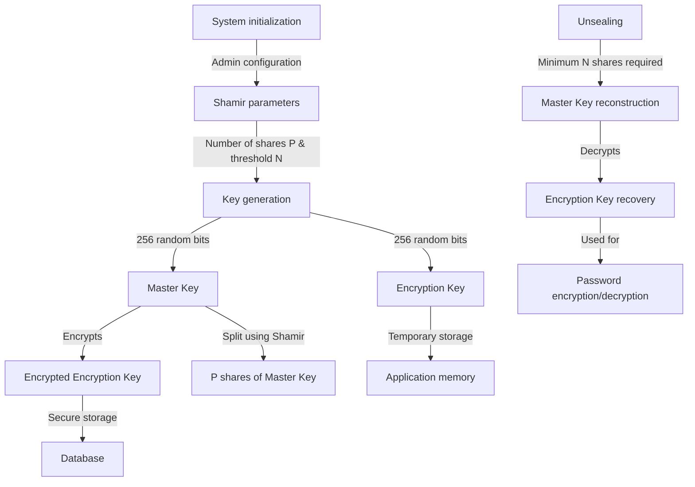

# Le Coffre

Le Coffre is an open-source password manager that allows you to securely store and manage passwords in a collaboration-friendly environment.

## Table of Contents

- [License](#license)
- [Contributing](#contributing)
- [Security implementation](#security-implementation)
- [Init](#init)
- [ORM](#orm)
- [TODO](#todo)
- [Library used](#library-used)
- [Production deployment](#production-deployment)
- [Security considerations](#security-considerations)
- [Setup](#setup)
- [Development Server](#development-server)
- [Production](#production)
- [Security](#security)
  - [Process of creation of the encryption key](#process-of-creation-of-the-encryption-key)
  - [Process of encryption and decryption of a password](#process-of-encryption-and-decryption-of-a-password)

## License

This project is licensed under the MIT License. You are free to use, modify, and distribute this project under the terms of the license.

## Contributing
We welcome contributions from the community! To contribute:

1. Fork the repository.
2. Create a new branch for your feature or bug fix.
3. Commit your changes with clear and descriptive messages.
4. Open a pull request and describe your changes.

Please read our CONTRIBUTING.md for detailed guidelines.

## Security implementation

Le Coffre uses the following security measures to ensure the safety of your passwords:

1. At initialization, a random 256-byte key is generated, Shamir is then used to split the key into P shares, N of which are needed to reconstruct the key (P, N are configurable).
2. This master key serve to encrypt the encryption key.
3. Each password is uniquely salted with a random 256-byte key generated at the time of password creation and encrypted using the encryption key.

## Init

1. Shamir process starts.
2. User is invited to create an admin account (mail, password, name).
3. Once completed, user is redirected to the admin panel where the user can setup providers, manage users,
   password entries...

## TODO

- [ ] Generate encryption key when master key is created
- [ ] Setup an ORM for database (kysely) and extends better-auth model
- [ ] Add a password generator
- [ ] Permission system
- [ ] Organize passwords in folders
- [ ] Customize folders (name, colors, icons)
- [ ] Add metadata to passwords (url, tags, notes, etc.)
- [ ] Search function
- [ ] Rotate passwords (notify user when password is about to expire)
- [ ] Audit log for all actions (who, when, what, where)
- [ ] Clear clipboard after a certain time
- [ ] Versioning of passwords and metadata (keep track of changes, rollback if needed)
- [ ] Add a bin for deleted passwords (soft delete)
- [ ] Allow regeneration of Shamir shares / encryption key generation and reencryption of all passwords
- [ ] Allow import/export of passwords from other password managers (Keepass, CSV, JSON, etc.)

## Library used

- Nuxt
- Nuxt UI
- Better Auth
- shamir-secret-sharing

## Production deployment

1. Behind a reverse proxy (nginx, caddy, etc.) with SSL termination.
2. Use the hardened Docker image provided.

## Security considerations

Before considering deploying Le Coffre in a production environment, please consider the following security measures:

1. The application is designed to be run in a secure environment, such as a private server or a trusted cloud provider. Any memory access is beyond threat model.
   See: https://github.com/hashicorp/vault/issues/1446 for comparable issue.
2. Limit access to the application to trusted users only. Use strong passwords and two-factor authentication (2FA) where possible.
3. Regularly update the application and its dependencies to ensure that any security vulnerabilities are patched.
4. Monitor the application for any suspicious activity, such as unauthorized access attempts or unusual behavior.
5. Regularly back up the database and other important data to prevent data loss in case of a security breach or other disaster.
6. Consider using a web application firewall (WAF) to protect the application from common web-based attacks, such as SQL injection and cross-site scripting (XSS).
7. Limit the number of users who have administrative access to the application, and regularly review user permissions to ensure that only authorized users have access to sensitive data.
8. Limit access to the application to trusted IP addresses / networks, and use a VPN or other secure connection method to access the application remotely.

## Setup

Make sure to install dependencies:

```bash
# npm
npm install

# pnpm
pnpm install

# yarn
yarn install

# bun
bun install
```

## Development Server

### Using Devcontainer (Recommended)

Open with VSCode and reopen in the devcontainer when prompted. The unified devcontainer includes both frontend and backend development environments with nginx as a reverse proxy.

**Quick Start:**
1. Open project in VS Code
2. Click "Reopen in Container" when prompted (VS Code will automatically detect your user's UID/GID and configure the container accordingly)
3. Use VS Code tasks to start services:
   - Press `Ctrl+Shift+P` → "Run Task" → "Start All Services"

See [.devcontainer/README.md](.devcontainer/README.md) for detailed instructions.

**Access Points:**
- **Main App:** http://127.0.0.1:8123 (via nginx - use this for development)
- Frontend (direct): http://127.0.0.1:5173
- Backend API (direct): http://127.0.0.1:8000
- API Docs: http://127.0.0.1:8000/docs
- OpenAPI Spec: http://127.0.0.1:8000/openapi.json

> **Why nginx?** The frontend makes API calls to `/api/*` which are proxied to the backend. Always use port 8123 for development.

### Manual Setup

Within each `frontend/` or `server/` folder you will find a README.md with more details.

## Production

Build the application for production:

```bash
# Build docker
docker build -t le-coffre .
# Create a named volume
docker volume create le-coffre-volume
# Run a container using the named volume
docker run -p 3000:3000 le-coffre:latest --volume le-coffre-volume:/app

# Pull docker image
docker pull rg.fr-par.scw.cloud/soma-smart-cr/le-coffre:latest
```


## Security

### Process of creation of the encryption key

During initialization, the administrator configures two essential parameters:

- The total number of shares (P) for the Master Key
- The reconstruction threshold (N), which defines the minimum number of shares needed to reconstruct the Master Key
- The system then generates two 256-bit cryptographic keys:

Master Key: Primary key which:

- Is used to encrypt the Encryption Key before storing it in the database
- Is immediately divided into P distinct shares using Shamir's algorithm
- Is never kept whole in the system after its creation

Encryption Key: Operational key which:

- Is temporarily stored in memory for encryption/decryption operations
- Is also stored in the database, but only in a form encrypted by the Master Key
- Enables the encryption and decryption of passwords and sensitive data

Shamir's algorithm ensures that at least N shares out of P are necessary to reconstruct the Master Key.
This approach provides enhanced security: even if some shares are compromised,
the Master Key remains protected as long as fewer than N shares are exposed.

When the application restarts, an unsealing process requires providing at least N shares to temporarily reconstruct the Master Key,
decrypt the Encryption Key, and place it in memory for use.

All encryption and decryption operations use the AES-256-GCM algorithm,
providing both confidentiality and data authenticity.



### Process of encryption and decryption of a password

In this process, we assume that the database is unsealed (Encryption key is stored in memory).

When a user creates a password,
the system generates a random Initialization Vector (IV) and
uses it to encrypt the password with the Encryption Key using AES-256-GCM.
The IV is stored in the database alongside the encrypted password.

When a user wants to retrieve a password, the system:

1. Authenticates the user's access permissions
2. Fetches the encrypted password and IV from the database
3. Decrypts the password using the Encryption Key stored in memory
4. Presents the plaintext password to the user
5. Securely clears the plaintext password from memory after use

The IV is essential for ensuring that the same password encrypted multiple times will yield different ciphertexts, preventing pattern analysis and enhancing security.

```mermaid
flowchart TD
    %% Styles
    classDef sensitive fill:#ffcccc,stroke:#ff0000
    classDef encrypted fill:#ccffcc,stroke:#00aa00
    classDef storage fill:#f9f9f9,stroke:#666
    classDef memory fill:#e6f3ff,stroke:#0066cc

    subgraph s1["Password Encryption Process"]
        A(["Plaintext Password"]):::sensitive
        B["Random IV Generator"]
        C["AES-256-GCM Encryption"]
        D[(Database)]:::storage
        E(["Encryption Key in Memory"]):::memory

        A --> C
        B --> |"Generates unique IV"| C
        E --> |"Used for encryption"| C
        C --> |"Store encrypted password"| D
        B --> |"Store IV"| D
    end

    subgraph s2["Password Decryption Process"]
        F(["User Authentication"])
        G[(Database)]:::storage
        H["Encrypted Password"]:::encrypted
        I["Initialization Vector"]
        J(["Encryption Key in Memory"]):::memory
        K["AES-256-GCM Decryption"]
        L(["Plaintext Password"]):::sensitive
        M["Memory Cleaning"]

        F --> |"If authorized"| G
        G --> H & I
        H --> K
        I --> K
        J --> |"Used for decryption"| K
        K --> L
        L --> |"After use"| M
        M --> |"Secure erasure"| N["Memory cleared"]
    end

    %% Legend
    O(["Sensitive Data"]):::sensitive
    P["Encrypted Data"]:::encrypted
    Q[(Storage)]:::storage
    R(["Memory"]):::memory
```


