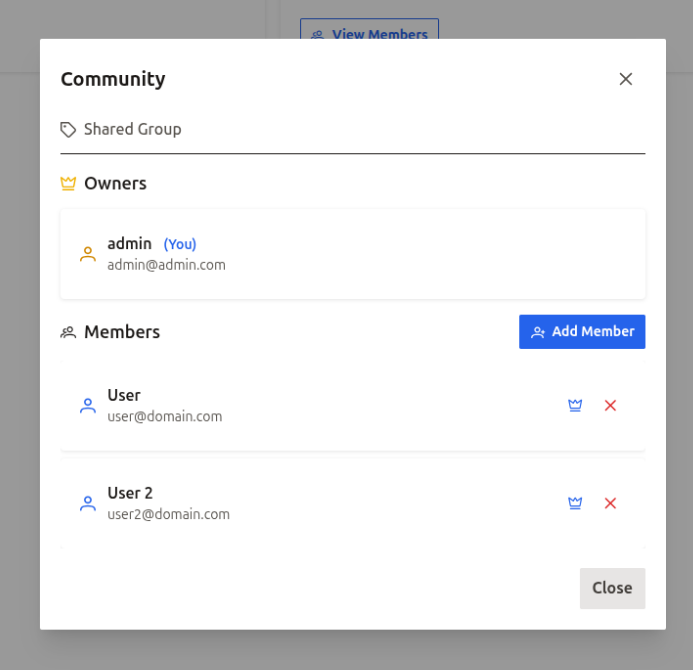
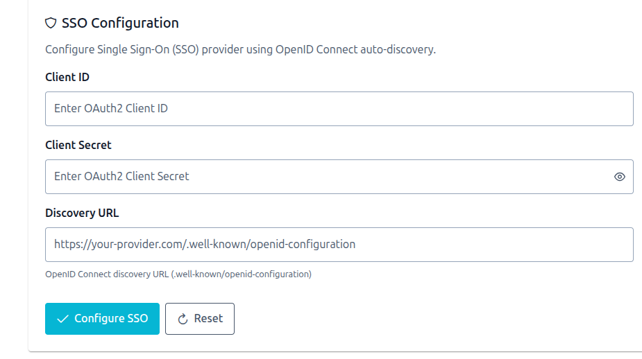
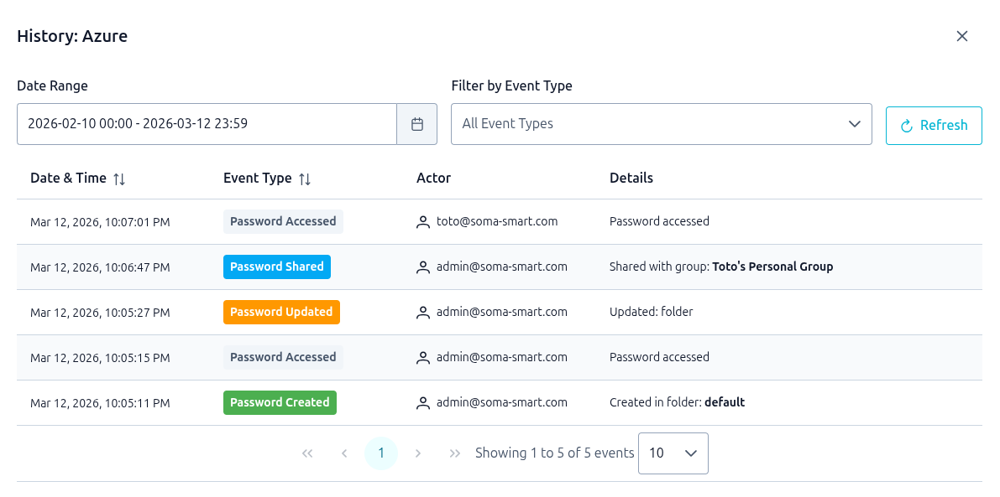
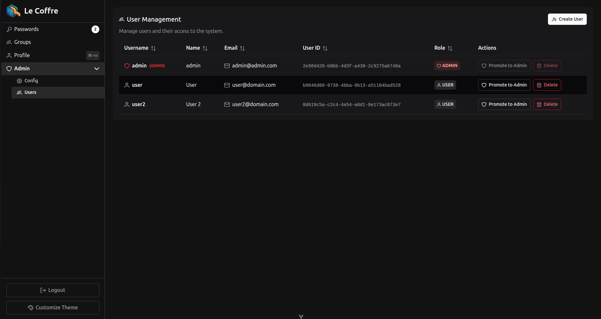

# Le Coffre

<p align="center">
   
</p>

Le Coffre is an open-source password manager that allows you to securely store and manage passwords in a collaboration-friendly environment.

> 🇫🇷 Proudly supported by [SOMA 🦊](https://www.soma-smart.com)

## Application

### Setup and Encrypt Le Coffre in seconds


### Creation, Update, Sharing of Passwords ultra secure


### Group system easy to use


### SSO


### Password audit


### Admin view


## Simple to deploy

### Docker images
> rg.fr-par.scw.cloud/somait-cr:le-coffre-frontend:tag_version<br>
> rg.fr-par.scw.cloud/somait-cr:le-coffre-backend:tag_version

### Docker compose
```bash
# 1. Create your env file
cp .env.example .env

# 2. Generate a secret key
echo "JWT_SECRET_KEY=$(openssl rand -base64 32)" >> .env
```

**Option A — external database** (recommended): set `DATABASE_URL` in `.env`, then:
```bash
docker compose up -d
```

**Option B — bundled PostgreSQL**: set `POSTGRES_PASSWORD` in `.env`, then:
```bash
docker compose --profile postgres up -d
```

Visit <http://localhost> and you're done

### In local

[See here](#Development)


# Tech
## Frontend ([README.md](frontend/README.md))

- Vue 3 + Vite
- PrimeVue 4 (UI components)
- Tailwind CSS
- Pinia (state management)
- Zod (schema validation)

## Backend ([README.md](server/README.md))

- FastAPI
- SQLModel + Alembic (ORM & migrations)
- PyCryptodome (AES encryption, Shamir's Secret Sharing)
- Authlib (SSO / OAuth2 OIDC), PyJWT (auth tokens)
- passlib + bcrypt (password hashing)

# Development

## Using Devcontainer (Recommended)

Open with VSCode and reopen in the devcontainer when prompted. The unified devcontainer includes both frontend and backend development environments with nginx as a reverse proxy.

**Quick Start:**

1. Open project in VS Code
2. Click "Reopen in Container" when prompted
3. Use VS Code tasks to start services:
   - Press `Ctrl+Shift+P` → "Run Task" → "Start All Services"

See [.devcontainer/README.md](.devcontainer/README.md) for detailed instructions.

**Access Points:**

- **Main App:** <http://127.0.0.1:8123> (via nginx - use this for development)
- Frontend (direct): <http://127.0.0.1:5173>
- Backend API (direct): <http://127.0.0.1:8000>
- API Docs: <http://127.0.0.1:8000/docs>
- OpenAPI Spec: <http://127.0.0.1:8000/openapi.json>

> **Why nginx?** The frontend makes API calls to `/api/*` which are proxied to the backend. Always use port 8123 for development.

# Security

## Implementation

See [CRYPTOGRAPHIC_ARCHITECTURE.md](CRYPTOGRAPHIC_ARCHITECTURE.md)

## Considerations

See [SECURITY.md](SECURITY.md).
